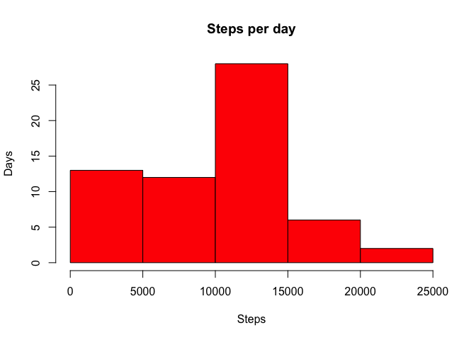

# Reproducible Research: Peer Assessment 1


## Loading and preprocessing the data


```r
rawData <- read.csv("/Users/Fang/Desktop/Data_Science/Coursera/Reproducible_Research/activity.csv")
```


```r
library(dplyr)
```

```
## 
## Attaching package: 'dplyr'
```

```
## The following objects are masked from 'package:stats':
## 
##     filter, lag
```

```
## The following objects are masked from 'package:base':
## 
##     intersect, setdiff, setequal, union
```

```r
## transform data_frame data to tbl_frame data which can be applied by group_by function
groupData <- tbl_df(rawData)
## remove the original data frame rawData
rm(rawData)
## group data by date
day_groupData <- group_by(groupData, date)
## get total steps for each day
total_steps <- summarise(day_groupData, total.steps = sum(steps,na.rm  = TRUE))
## names(total_steps) = c("date", "total.steps")
```

## What is mean total number of steps taken per day?

- **Make a histogram of the total number of steps taken each day**.


```r
## plot histogram of total steps for each day
hist(total_steps$total.steps, xlab = "Steps", ylab = "Days", main = "Steps per day", col = "red")
```



- **Calculate and report the mean and median of the total number of steps taken per day**.


```r
ave_steps <- mean(total_steps$total.steps, na.rm = TRUE)
med_steps <- median(total_steps$total.steps, na.rm = TRUE)
```

The mean total number of steps taken per day: **9354.2295082**.

The median total number of steps taken per day: **10395**.


## What is the average daily activity pattern?

- **Make a time series plot (i.e. type = "l") of the 5-minute interval (x-axis) and the average number of steps taken, averaged across all days (y-axis)**.


```r
intv_groupData <- group_by(groupData, interval)
ave_intv_steps <- summarise(intv_groupData, mean(steps, na.rm = TRUE))
names(ave_intv_steps) = c("interval", "ave.steps")
plot(c(1:length(ave_intv_steps$interval)), ave_intv_steps$ave.steps, type = "l", xlab = "5-min. interval", ylab = "Average Steps", main = "Daily Average Interval Steps", col = "red")
```


- **Which 5-minute interval, on average across all the days in the dataset, contains the maximum number of steps?**


```r
indx <- which(ave_intv_steps$ave.steps == max(ave_intv_steps$ave.steps))
max_intv <- ave_intv_steps[indx, 1]
```

```r
indx
```

```
## [1] 104
```

```r
max_intv
```

```
## Source: local data frame [1 x 1]
## 
##   interval
##      (int)
## 1      835
```

The **104**th 5-minutes interval which is **835** contains the maximum number of steps.

## Imputing missing values

- **Calculate and report the total number of missing values in the dataset (i.e. the total number of rows with NAs).**


```r
missing_count <- sum(!complete.cases(intv_groupData))
missing_count
```

```
## [1] 2304
```

There are **2304** missing values in the dataset.

- **Create a new dataset that is equal to the original dataset but with the missing data filled in.**

- **Use the mean/median for that day, or the mean for that 5-minute interval to fill in all of the missing values in the dataset.**


```r
newData <- groupData
intv_newData <- group_by(newData, interval)
ave_intv_newSteps <- summarise(intv_newData, mean(steps, na.rm = TRUE))
names(ave_intv_newSteps) = c("interval", "ave.steps")
fill_steps <- function(inter) {
        return(ave_intv_newSteps[ave_intv_newSteps$interval == inter, ]$ave.steps) 
}

newData[is.na(newData$steps), "steps"] <- sapply(newData[is.na(newData$steps), ]$interval, fill_steps)
missing_count1 <- sum(!complete.cases(newData))
missing_count1
```

```
## [1] 0
```

There are **0** missing value in the new dataset newData.

- **Make a histogram of the total number of steps taken each day and Calculate and report the mean and median total number of steps taken per day.**


```r
day_newData <- group_by(newData, date)
total_day_steps <- summarize(day_newData, sum(steps))
names(total_day_steps) = c("date", "total.steps")
hist(total_day_steps$total.steps, xlab = "Steps per Day", main = "Imputing Missing Values", col = "skyblue")
```


```r
ave_new_steps <- mean(total_day_steps$total.steps, na.rm = TRUE)
med_new_steps <- median(total_day_steps$total.steps, na.rm = TRUE)
```


```r
ave_new_steps
```

```
## [1] 10766.19
```

```r
med_new_steps
```

```
## [1] 10766.19
```

The mean total number of steps taken per day: **1.0766189\times 10^{4}**.

The median total number of steps taken per day: **1.0766189\times 10^{4}**.

These values differ from the estimates from the first part of the assignment very slightly.  The impact of imputing missing data on the estimates of the total daily number of steps is small.

## Are there differences in activity patterns between weekdays and weekends?

- **Create a new factor variable in the dataset with two levels – “weekday” and “weekend” indicating whether a given date is a weekday or weekend day.**

```r
week_data <- ifelse(weekdays(as.Date(newData$date), abbreviate = T) %in% c("Sat", "Sun"), "weekend", "weekday")
#mutate(newData, day = week_data)
newData$day <- week_data
#week_data <- weekdays(as.Date(newData$data), abbreviate = T)
#for (i in 1:length(week_data)) {
#        if (week_data[i] == "Sat" | week_data[i] == "Sun") {
#                     week_data[i] = "weekend"
#             } else {
#                     week_data[i] = "weekday"
#             }
#}
#
#newData$day <- week_data
```

- **Make a panel plot containing a time series plot (i.e. type = "l") of the 5-minute interval (x-axis) and the average number of steps taken, averaged across all weekday days or weekend days (y-axis).** 


```r
weekday_data <- filter(newData, day == "weekday")
intv_weekday_data <- group_by(weekday_data, interval)
ave_intv_weekday_data <- summarise(intv_weekday_data, mean(steps, na.rm = TRUE))
names(ave_intv_weekday_data) = c("interval", "ave.steps")

weekend_data <- filter(newData, day == "weekend")
intv_weekend_data <- group_by(weekend_data, interval)
ave_intv_weekend_data <- summarise(intv_weekend_data, mean(steps, na.rm = TRUE))
names(ave_intv_weekend_data) = c("interval", "ave.steps")

par(mfrow = c(1, 2))
plot(1:length(ave_intv_weekday_data$interval), ave_intv_weekday_data$ave.steps, type = "l", xlab = "5-min interval", ylab = "Ave. number of steps", main = "Ave. # of steps in a weekday", col = "red")

plot(1:length(ave_intv_weekend_data$interval), ave_intv_weekend_data$ave.steps, type = "l", xlab = "5-min interval", ylab = "Ave. number of steps", main = "Ave. # of steps in a weekend", col = "skyblue")
```


